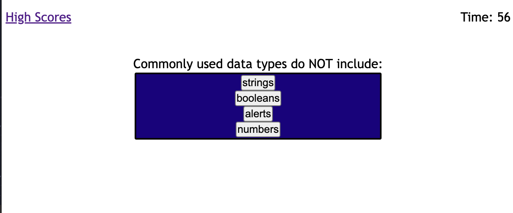
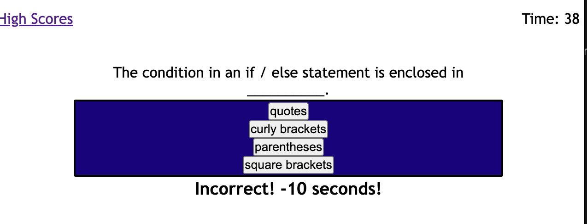
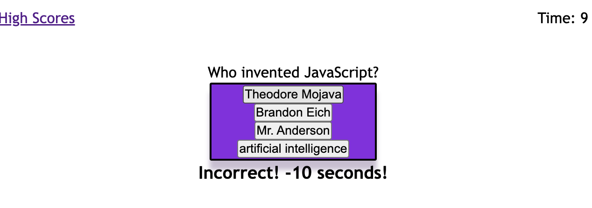

# JavaScript Quiz

## A basic quiz on Coding

GITHUB LINK:

https://github.com/LujanSolo/coding-quiz

DEPLOYED SITE LINK:

A basic box quiz with multiple choice answers all centered around the topic of coding. The application pushes questions and answers directly from javaScript to the index.

The coder's hope was to challenge their understanding of javaScript, proper function design, and workflow theories. 

## Usage

To begin the game, press the "BEGIN!" button at the opening screen. Read the questions and try to answer correctly, as incorrect answers will deduct 10 seconds from the starting timer.

Images from site:

-Quiz at start screen:

  and progressive images:

## Credits

The coder used these outside sources to help complete this project:

1. https://codepen.io/kanishkkunal/pen/obGojO
2. https://www.youtube.com/watch?v=49pYIMygIcU&t=226s
3. https://www.geeksforgeeks.org/how-to-create-a-simple-javascript-quiz/
4. https://github.com/JoelDore/Code-Quiz
5. https://github.com/Sam-T-G

## License

MIT License

Copyright (c) 2022 Jamie Lujan

Permission is hereby granted, free of charge, to any person obtaining a copy
of this software and associated documentation files (the "Software"), to deal
in the Software without restriction, including without limitation the rights
to use, copy, modify, merge, publish, distribute, sublicense, and/or sell
copies of the Software, and to permit persons to whom the Software is
furnished to do so, subject to the following conditions:

The above copyright notice and this permission notice shall be included in all
copies or substantial portions of the Software.

THE SOFTWARE IS PROVIDED "AS IS", WITHOUT WARRANTY OF ANY KIND, EXPRESS OR
IMPLIED, INCLUDING BUT NOT LIMITED TO THE WARRANTIES OF MERCHANTABILITY,
FITNESS FOR A PARTICULAR PURPOSE AND NONINFRINGEMENT. IN NO EVENT SHALL THE
AUTHORS OR COPYRIGHT HOLDERS BE LIABLE FOR ANY CLAIM, DAMAGES OR OTHER
LIABILITY, WHETHER IN AN ACTION OF CONTRACT, TORT OR OTHERWISE, ARISING FROM,
OUT OF OR IN CONNECTION WITH THE SOFTWARE OR THE USE OR OTHER DEALINGS IN THE
SOFTWARE.
